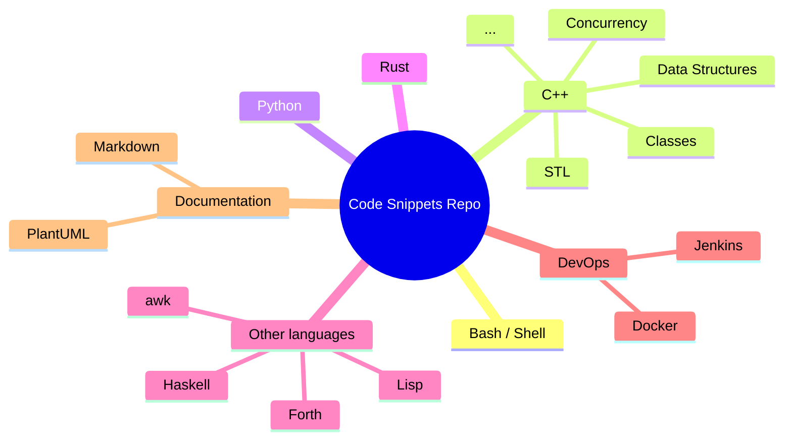

# Code-Snippets

Collection of code snippets for various languages.

```mermaid
mindmap
  root((Code Snippets Repo))
    Bash / Shell
    C++
      Classes
      Data Structures
      Concurrency
      STL
      ...
    Python
    Rust
    Other languages
      awk
      Forth
      Haskell
      Lisp
    DevOps
      Docker
      Jenkins
    Documentation
      Markdown
      PlantUML
```
